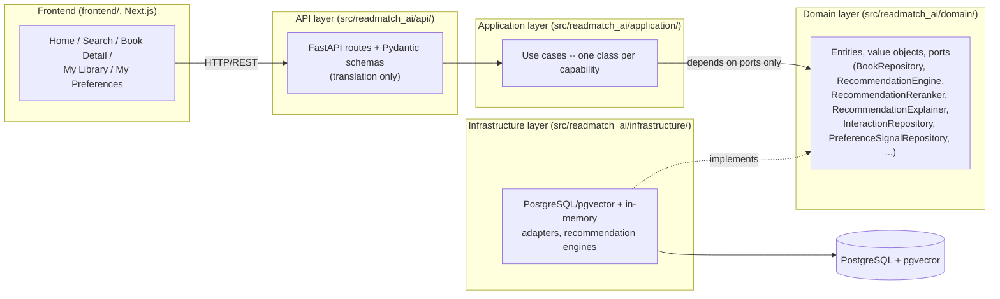
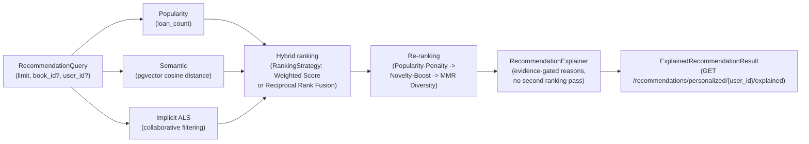
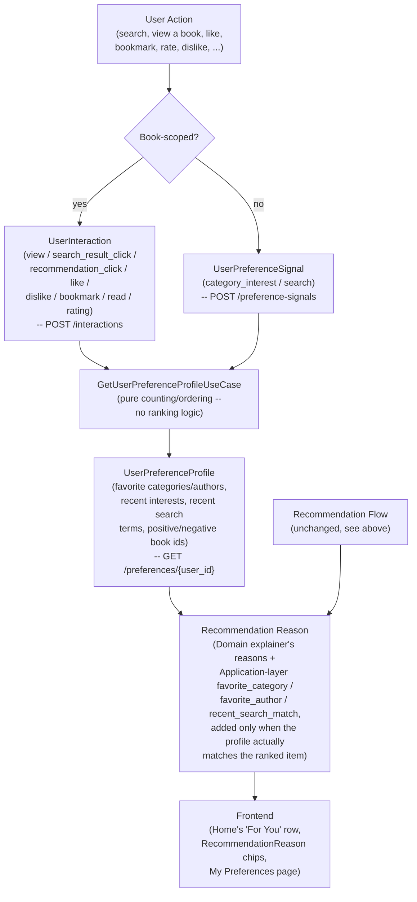
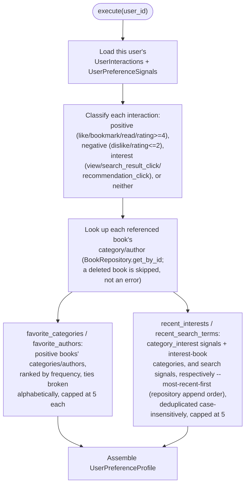

# System Architecture

## Pipeline

```text
Public Book Data (data4library API)
→ Import (scripts/import_books.py)
→ PostgreSQL (books, book_popularity, book_embeddings, user_book_interactions)
→ Embeddings (BookEmbeddingGenerator → pgvector) / Interactions (ALS training)
→ Candidate Generation (Popularity, Semantic, ALS — independent RecommendationEngines)
→ Hybrid Ranking (pluggable RankingStrategy: Weighted Score Fusion or Reciprocal Rank Fusion)
→ Re-ranking (Popularity-Penalty → Novelty-Boost → MMR Diversity)
→ Explanation (RecommendationExplainer, evidence-gated, no second ranking pass)
→ Evaluation (offline metrics, quality reports, regression checks)
→ FastAPI REST API (+ OpenAPI docs)
→ Frontend (frontend/, Next.js/TypeScript — consumes the REST API
  directly over HTTP; no server-side framework/database of its own)
```

The REST API and its interactive OpenAPI documentation (`/docs`) remain
usable independently of the frontend (e.g. `scripts/run_demo.py`). See the
README's Architecture section for the full per-layer breakdown and file
paths, and `frontend/README.md` for the frontend's own layout.

## System Structure



Dependency direction is always inward: Infrastructure and API depend on
Domain ports; Domain and Application never depend outward on either. The
composition root (`application_context.py`) is the one place that wires a
concrete Infrastructure adapter to each Domain port.

## Candidate Sources

- Popularity — persisted loan count.
- Semantic similarity — embeddings compared via pgvector cosine distance.
- Collaborative filtering — implicit ALS, trained from recorded
  user/book interactions.

## Architectural Layers (Hexagonal / Ports and Adapters)

- **Domain** — entities, value objects, and ports. No outward dependency;
  no raw environment-variable access.
- **Application** — use cases, depending only on Domain ports (never on the
  composition root itself).
- **Infrastructure** — adapters: PostgreSQL/pgvector repositories,
  in-memory repositories, the recommendation engines, structured-logging
  observability.
- **API** — FastAPI routes and Pydantic schemas; translation only, no
  business logic.
- **Composition root and cross-cutting orchestration** —
  `application_context.py` (the composition root), plus `config.py`,
  `runtime_configuration.py`, `deployment_validation.py`, `operations.py`,
  and `release_automation.py`, each kept outside the four layers above
  because each legitimately needs something a Domain/Application module
  deliberately cannot touch (raw environment access, the composition root,
  or process-level I/O).

## Data Rules

PostgreSQL is the operational source of truth; pgvector stores embeddings
in the same database — there is no separate offline/file-based storage
layer.

Embeddings, the trained ALS model, recommendations, and quality reports are
all derived, reproducible artifacts, never an independent source of truth.

## Ranking Rules

- Fuse candidate scores via the configured `RankingStrategy` (Weighted
  Score Fusion or Reciprocal Rank Fusion) before combining sources.
- Preserve each candidate's contributing source(s)
  (`RecommendationItem.contributing_sources`) through fusion, so downstream
  explanation and re-ranking can reason about provenance honestly rather
  than guessing.
- Re-rank (popularity-penalty, novelty-boost, MMR diversity) as an
  independent stage after Hybrid ranking, never inside it.
- Use Popularity as the cold-start fallback whenever Semantic/ALS have no
  usable signal (no `book_id`, no `user_id`, or no trained data).

## Recommendation Flow



Popularity/Semantic/ALS are independent `RecommendationEngine`s; a missing
`book_id`/`user_id`/trained model simply means that source contributes
nothing (cold-start degrades gracefully to whichever sources remain
active), never an error.

## User Behavior Data Flow

Added in Sprint 13-14, layered on top of the Recommendation Flow above
without changing it — the profile only annotates the *reasons* an
already-ranked item is given, never its score or position.



## User Preference Profile Generation

`GetUserPreferenceProfileUseCase.execute(user_id)` (Application layer) --
purely a read-time aggregation over a user's own already-recorded events,
recomputed on every call, never a persisted entity of its own:



A user with no qualifying signal yet gets an all-empty/zero profile --
the same cold-start convention every other `user_id`-scoped endpoint in
this API already follows, never an error.

## Production Readiness

Layered on top of the recommendation pipeline without altering its
contracts, each stage reusing the one beneath it rather than duplicating
any check:

1. **Configuration validation** — fail-fast, aggregated, redacted
   (`runtime_configuration.py`).
2. **Persistence/pgvector runtime validation** — read-only, integrated
   with readiness (`infrastructure/postgresql_persistence_runtime_validator.py`).
3. **Deployment/container startup validation** — end-to-end, in-process
   (`deployment_validation.py`).
4. **Operations reporting** — aggregated, read-only
   (`operations.py`).
5. **Release automation** — orchestrates 1-4 plus the project's own
   quality gates (`release_automation.py`).

See the README's own sections of the same names for command usage and
example output, and `docs/progress/PROJECT_PROGRESS.md` (Sprints 31-36)
for the build history behind each.
